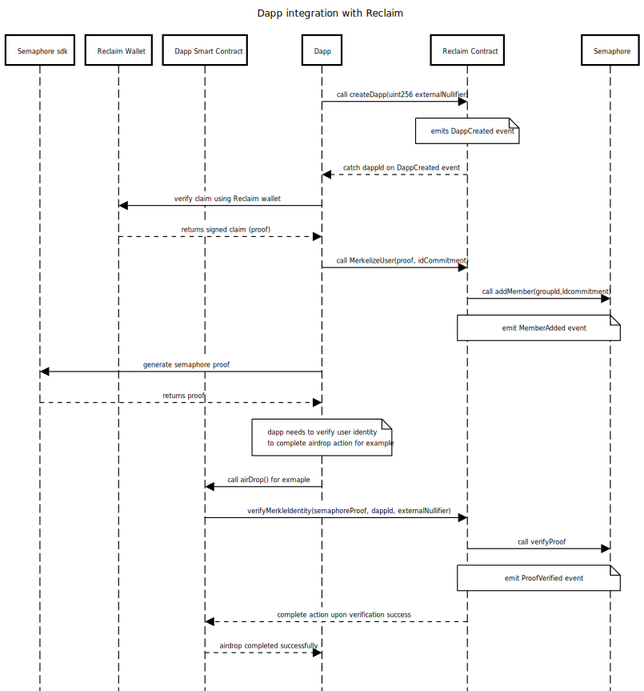

# Reclaim Smart Contract

EVM smart contract that enables minting of credentials on-chain through a network of oracles and semaphore.

## Setup

1. Run `npm install --legacy-peer-deps`
2. To test, `npm run test`

## Contracts Addresses

### Optimism Goerli

| Contract              | Address                                    |
|-----------------------|--------------------------------------------|
| Reclaim               | 0xCc08210D8f15323104A629a925E4cc59D0fa2Fe1 |
| Semaphore             | 0xACE04E6DeB9567C1B8F37D113F2Da9E690Fc128d |
| SemaphoreVerifier     | 0x93a9d327836A5279E835EF3147ac1fb54FBd726B |

### Linea Testnet

| Contract              | Address                                    |
|-----------------------|--------------------------------------------|
| Reclaim               | 0xf223E215B2c9A2E5FE1B2971d5694684b2E734C1 |
| Semaphore             | 0xd9692F91DC89f14f4211fa07aD2Bd1E9aD99D953 |
| SemaphoreVerifier     | 0xD594971cea3fb43Dd3d2De87C216ac2aCE320fc2 |


## Commands

- `NETWORK={network} npx hardhat deploy` to deploy the Reclaim contract to a chain. `{network}` is the chain, for example, "eth-goerli" or "polygon-mainnet"
- `NETWORK={network} npx hardhat upgrade --address {proxy address of the Reclaim contract}` to upgrade the contract

- `npm run prettier` to lint your solidity files

## Integrating Dapp with Reclaim Flow




## Notes

1. GroupId is calculated from the provider string:

```
function calculateGroupIdFromProvider(
		string memory provider
	) internal pure returns (uint256) {
		bytes memory providerBytes = bytes(provider);
		bytes memory hashedProvider = abi.encodePacked(keccak256(providerBytes));
		uint256 groupId = BytesUtils.bytesToUInt(hashedProvider, 32);
		return groupId;
	}
```
